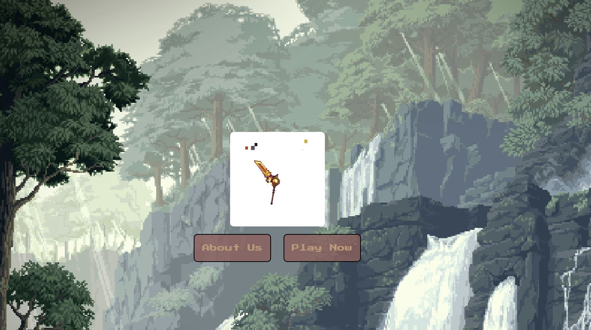
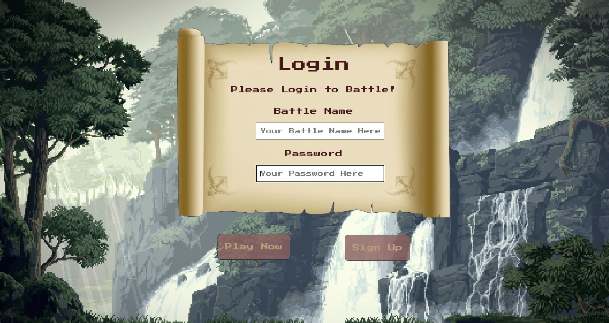
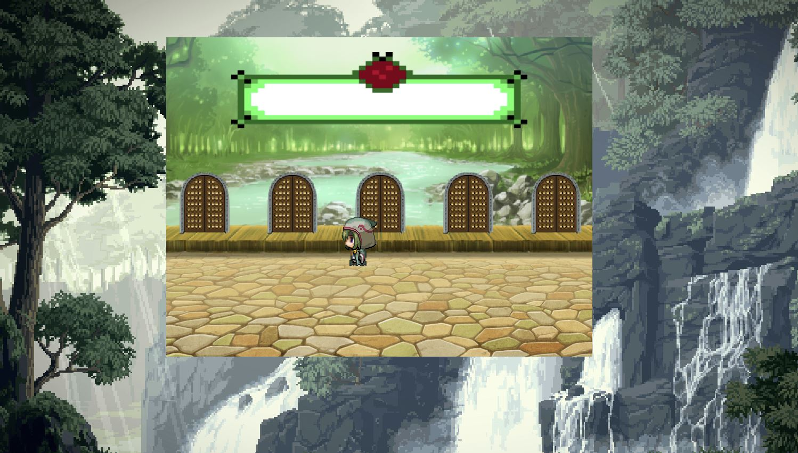
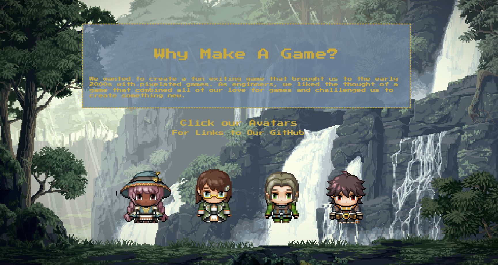
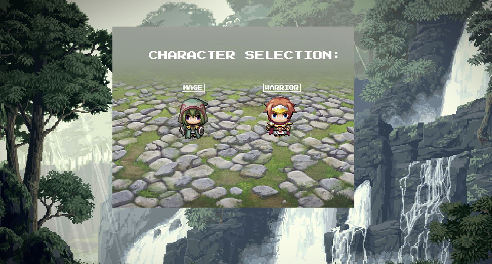
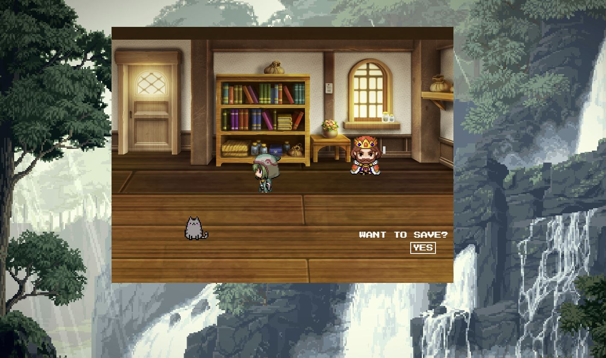
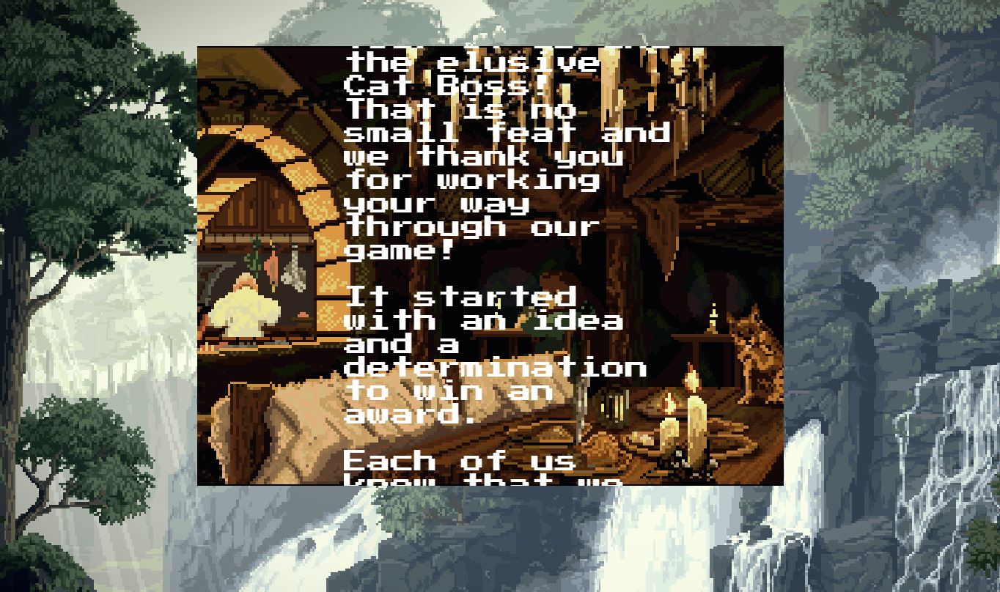

# [Project #3 - Battle Trail](https://github.com/JaHa675/project-3)

---

# Description

Welcome to the Battle Trail, a fun & exiting 2D RPG that is heavily inspired by 2000s pixelated games. As enginners, we liked the thought of a game that combined all of our love for games and challlenged us to create something new. We used technologies like React, JavaScript, and Phaser Game Engine to bring our idea of a quirky, sprite dominated game to life. Throughout the game you will see lots of pixel art from open soure sprite resources and characters that are based off the creators. We hope that you find joy in the little things will working your way through Battle Trail!

Check out our deployed project [here](https://github.com/JaHa675/project-3)! 

&nbsp;

---
# Table of Contents

  - [Description](#description)
  - [Table of Contents](#table-of-contents)
  - [Installation](#installation)
  - [Usage](#usage)
  - [Technologies Used](#technologies-used)
  - [Demo](#demo)
  - [Screenshots](#screenshots)
  - [Contributing](#contributing)
  - [Contact](#contact)
  - [License](#license)

&nbsp;

---
# Installation

Instructions: 
1. Fork the application front end repository & the application back end repository from GitHub and clone this project to your machine.
2. Open the projects with your preferred text-editor, such as VS code.
3. Prerequisite installations: Node.js, MySQL, React.
4. This project includes a `package.json` file that specifies dependencies for this project, which can be installed by running the command `"npm install"`.

&nbsp;

---
# Usage

Once the front end repository has been installed:
1. Open the project file within your terminal
2. Run command `"npm install"` to download all of the npm packages and their dependencies required to run the application.
1. Run command `"npm run start"` and React will start a local server at localhost:3001 on your default browser.
2. Open the back end repository and repeat steps 1 & 2. Running the server for both the front end and back end are necessary for use.
3. Sign up as a new user and play through the game!
4. When finished, run command `CONTROL-C` in the terminal to end the session.

&nbsp;

---
# Technologies Used

General Technologies: 
- [HTML](https://html.com/)
- [CSS](https://developer.mozilla.org/en-US/docs/Web/CSS)
- [Javascript](https://www.javascript.com/)
- [Node](https://www.npmjs.com/package/node)
- [Heroku](https://www.heroku.com/)
- [React Bootstrap](https://react-bootstrap.github.io/)
- [Phaser](https://phaser.io/)

NPM Packages
- [react-router-dom](https://www.npmjs.com/package/react-router-dom)
- [nodemon](https://www.npmjs.com/package/nodemon) 
- [Express](https://www.npmjs.com/package/express)

&nbsp;

---

&nbsp;

---
# Demo

## Landing Page

## Login/ SignUp

## Character Selection Demo

## Battle Selection and Attack Demo

&nbsp;

---
# Screenshots

## Landing Page

## Login/ Sign Up Page

## Main Path

## About Us

## Character Selection

## Safe House

## Credits

&nbsp;

---
# Contributing

This project was completed as a collaborative group for Project 3 from the University of Washington Full Stack Flex Coding Bootcamp. If you would like to contribute, please feel free to contact any of the team members with questions or comments. Our github links and emails can be found below.

&nbsp;

---
# Credits
- [Aseprite](https://www.aseprite.org/) - Spritesheet Creator
- [Google Fonts](https://fonts.google.com/) - Pixelated Font
- [Spriter's Resource](https://www.spriters-resource.com/) - Open Sprite Resource
- [Battle Backgrounds](https://www.spriters-resource.com/psp/lunarsilverstarharmony/sheet/58073/) - Open Sprite Resource
- - [Character Sprite Templates](https://www.spriters-resource.com/pc_computer/rpgmakermv/sheet/100167/) - Open Sprite Resource

---
# Contact

If you have any questions feel free to contact our team:
- Dahlia Graves | [Github](https://github.com/DahliaGRV) | [email](Dahliag@uw.edu)
- Lucas Roman | [Github](https://github.com/remotemana) | [email](lucas.e.roman@gmail.com)
- James Harding | [Github](https://github.com/JaHa675) | [email](jamesharding675@gmail.com)
- Brooke Love | [Github](https://github.com/brookelove) | [email](brookelovedevelops@gmail.com)

&nbsp;

---
## License

[MIT License](./LICENSE) 

Copyright (c) 2022

Permission is hereby granted, free of charge, to any person obtaining a copy
of this software and associated documentation files (the "Software"), to deal
in the Software without restriction, including without limitation the rights
to use, copy, modify, merge, publish, distribute, sublicense, and/or sell
copies of the Software, and to permit persons to whom the Software is
furnished to do so, subject to the following conditions:

The above copyright notice and this permission notice shall be included in all
copies or substantial portions of the Software.

THE SOFTWARE IS PROVIDED "AS IS", WITHOUT WARRANTY OF ANY KIND, EXPRESS OR
IMPLIED, INCLUDING BUT NOT LIMITED TO THE WARRANTIES OF MERCHANTABILITY,
FITNESS FOR A PARTICULAR PURPOSE AND NONINFRINGEMENT. IN NO EVENT SHALL THE
AUTHORS OR COPYRIGHT HOLDERS BE LIABLE FOR ANY CLAIM, DAMAGES OR OTHER
LIABILITY, WHETHER IN AN ACTION OF CONTRACT, TORT OR OTHERWISE, ARISING FROM,
OUT OF OR IN CONNECTION WITH THE SOFTWARE OR THE USE OR OTHER DEALINGS IN THE
SOFTWARE.